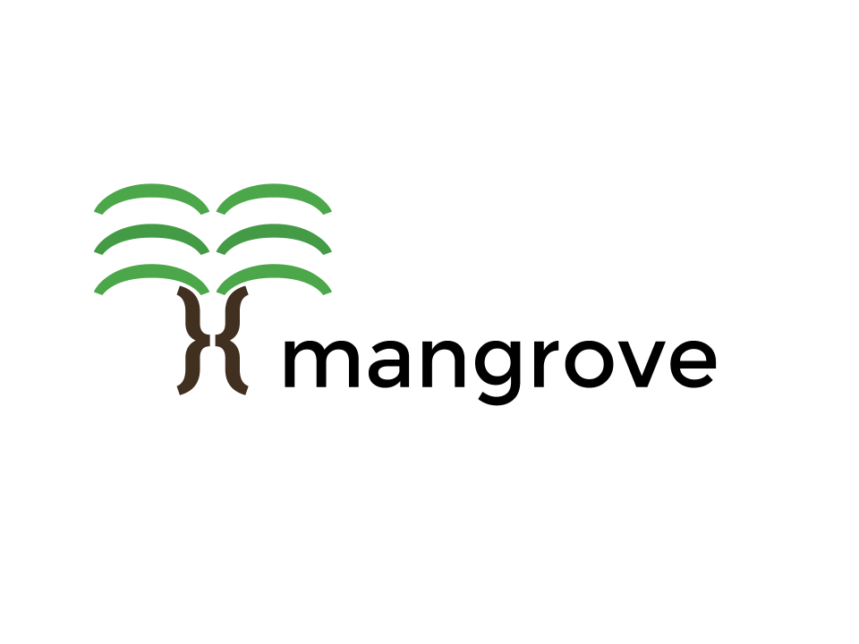

# Mangrove
Mangrove is an object document mapper for MongoDB written in C++.

## Features
Mangrove provides:
- Automatic serialization of complex objects to and from BSON
- A `collection` interface that uses objects instead of BSON
- A static query builder with compile-time checking

## Quickstart
(... installation ...)

After installation, using Mangrove is easy.
To use a class with the ODM, one simply creates a `serialize` function that will be used to convert objects too and from BSON.
The `serialize` function takes an Archiver object, and passes it name-value pairs corresponding to members which should be serialized.

```cpp
#include <bson_mapper/bson_archiver.hpp>

class Manatee {
public:
    int age;
    std::string name;
    double weight;

    template <class Archive>
    void serialize(Archive& ar) {
        ar(CEREAL_NVP(age), CEREAL_NVP(name), CEREAL_NVP(weight));
    }
};
```

Then, the `to_document` and `to_obj` functions will convert between BSON and objects for you:

```cpp
Manatee m = Manatee{12, "Melvin", 650.1};
bsoncxx::document::value v = bson_mapper::to_document(m);
std::cout << bsoncxx::to_json(v.view()) << std::endl;
```

The above code produces the following output:
```
> {
    'age': 12,
    'name': "Melvin",
    'weight': 650.1
}
```

One can also use specialized streams to rapidly serialize many objects or documents. This is covered in more detail in the tutorial. (TODO)

## Documentation
...

## License
The source files in this repository are made available under the terms of the Apache License, version 2.0.
